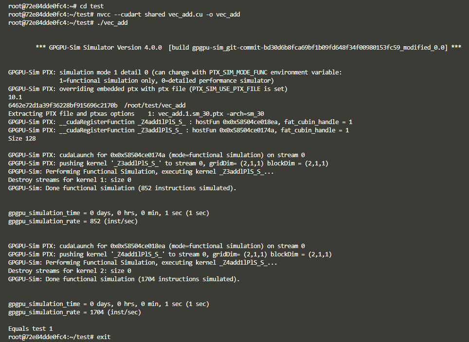

# Hit #1 - Setup del entorno CUDA

## Entorno utilizado
- Sistema operativo: Windows 11
- Docker version: Docker version 29.4.2, build 055a478
- Imagen utilizada: srirajpaul/gpgpu-sim:0.2
- CUDA version (dentro del contenedor): 10.1
- gcc/g++ version (dentro del contenedor): 7.5.0
- Simulador: GPGPU-Sim

## ¿Por qué el simulador?
GPU disponible es una AMD RX 6650XT, que no es compatible 
con CUDA ya que es tecnología exclusiva de NVIDIA. 
Se utiliza GPGPU-Sim como simulador de GPU para ejecutar 
código CUDA sin hardware NVIDIA.

## Pasos realizados
**1.** Verificar que Docker instalado
```powershell
docker --version
docker run hello-world
```

**2.**  Descargar y arrancar el contenedor GPGPU-Sim
```powershell
docker run -w /root -it srirajpaul/gpgpu-sim:0.2 /bin/bash
```
> Este comando descarga la imagen (puede tardar un poco la primera vez) y te deja dentro del contenedor con CUDA 10.1 y GPGPU-Sim listo.

**3.** Verificar que CUDA funciona dentro del contenedor
```bash
cd test
nvcc --cudart shared vec_add.cu -o vec_add
./vec_add
```
**4.** Para salir y volver a entrar al contenedor
```bash
# Salir
exit

# Ver el ID del contenedor
docker container ls -a

# Volver a entrar
docker start <container-id>
docker attach <container-id>
```

## Setup final verificado
