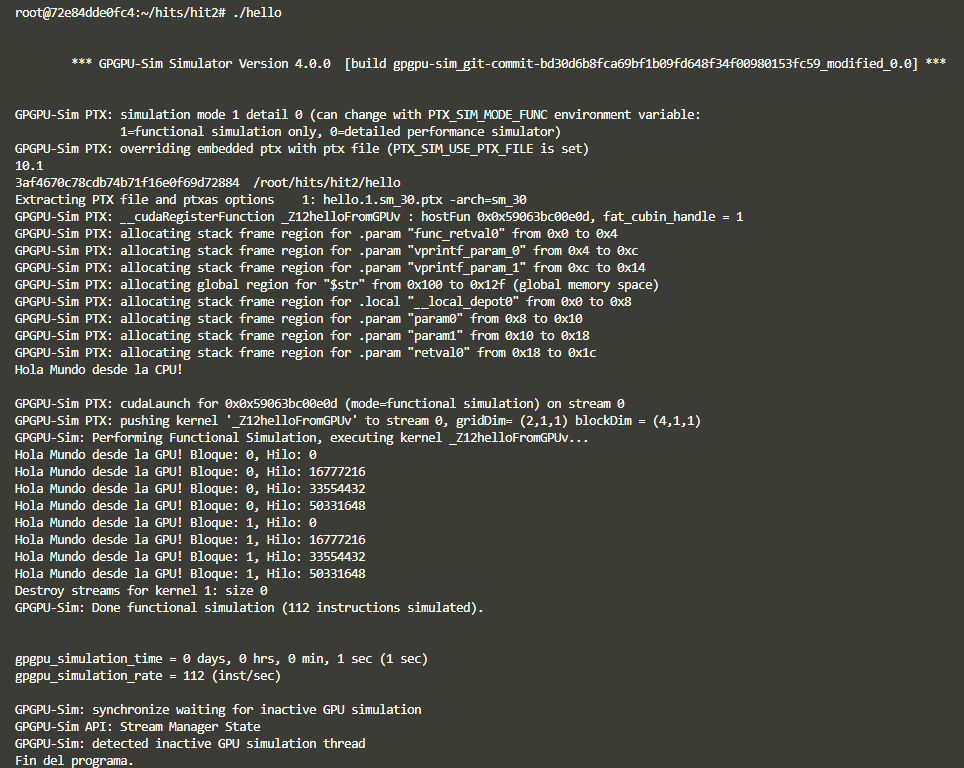

# Hit #2 - Hola Mundo en CUDA

## Entorno

- Contenedor: srirajpaul/gpgpu-sim:0.2
- CUDA: 10.1
- Simulador: GPGPU-Sim 4.0.0
- Arquitectura simulada: sm_30
- Modo: functional simulation

## Programa

El programa lanza un kernel con 2 bloques y 4 hilos por bloque
(8 hilos en total), cada uno imprime su identificador.

## Conceptos aprendidos

- `__global__`: define un kernel que corre en la GPU
- `<<<bloques, hilos>>>`: sintaxis de lanzamiento del kernel
- `blockIdx.x` / `threadIdx.x`: identificadores de bloque e hilo
- `cudaDeviceSynchronize()`: sincroniza CPU y GPU

## Limitación del simulador

GPGPU-Sim imprime threadIdx como un entero empaquetado en lugar
del componente .x, por lo que los índices aparecen como múltiplos
de 16777216 en lugar de 0, 1, 2, 3. Esto es una limitación
conocida del simulador y no ocurre en hardware NVIDIA real.

## Output obtenido

