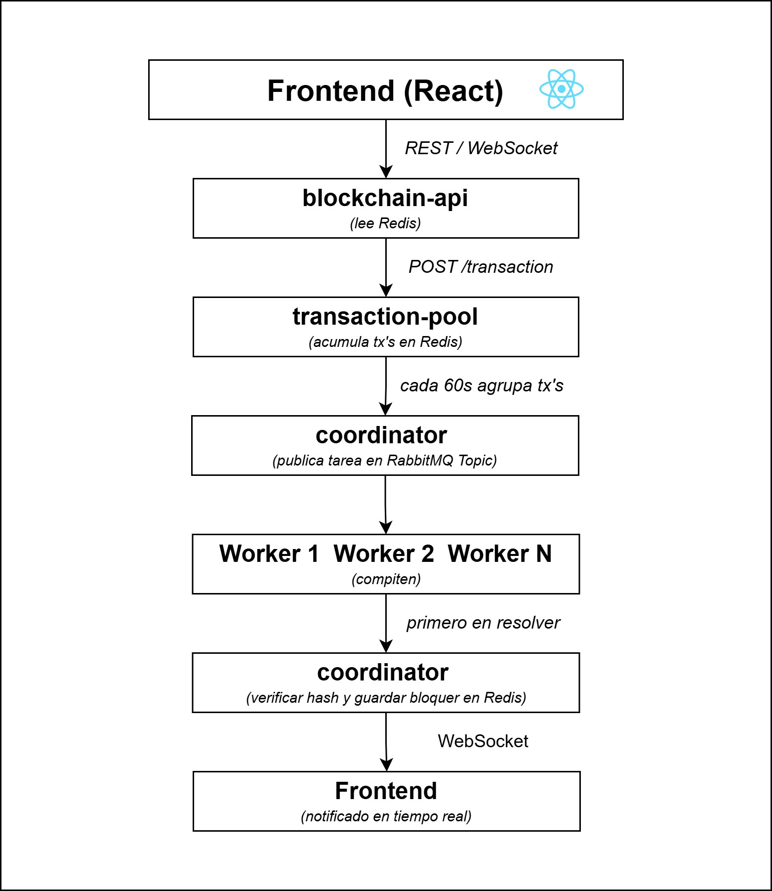

# Pilar 2 - Infraestructura de Servicios Distribuidos

## Descripción

Implementación de una blockchain distribuida con Proof of Work (PoW)
usando una arquitectura de microservicios. Cada servicio es independiente
y se comunica de forma asincrónica a través de RabbitMQ y Redis.

## Servicios

| Servicio           | Puerto | Descripción                      |
| ------------------ | ------ | -------------------------------- |
| `blockchain-api`   | 8080   | Backend REST + WebSocket         |
| `coordinator`      | 8081   | Nodo Coordinador de Tareas (NCT) |
| `transaction-pool` | 8082   | Pool de Transacciones (TrP)      |
| `worker`           | 8083   | Nodo Worker (minero CPU)         |
| `frontend`         | 3000   | Interfaz React                   |
| RabbitMQ UI        | 15672  | Panel de administración          |
| Redis              | 6379   | Base de datos blockchain         |

## Arquitectura



## Stack tecnológico

- **Java 21** + Spring Boot 3.5
- **Maven** (proyectos independientes con shared como dependencia)
- **RabbitMQ 4.1** (Queue para txs + Topic para tareas de minería)
- **Redis 8** (persistencia de bloques y transacciones)
- **Docker Compose** (desarrollo local)

## Levantar el stack localmente

```bash
# 1. Levantar infraestructura (RabbitMQ + Redis)
docker compose up -d

# 2. Publicar módulo shared
cd shared && mvn clean install

# 3. Levantar cada servicio en orden
cd blockchain-api     && mvn spring-boot:run
cd transaction-pool   && mvn spring-boot:run
cd coordinator        && mvn spring-boot:run
cd worker             && mvn spring-boot:run
cd frontend           && npm install && npm run dev
```

## Módulo shared

Contiene los modelos y utilidades compartidas entre todos los servicios.
Debe publicarse en Maven local antes de compilar cualquier servicio:

```bash
cd shared && mvn clean install
```
