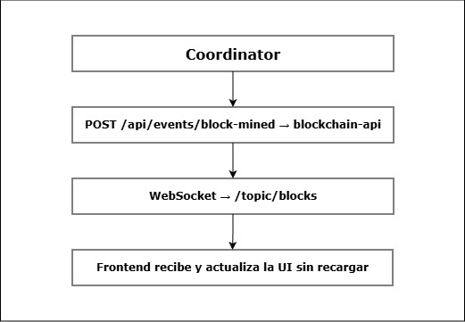

# Blockchain API - Backend REST + WebSocket

## Descripción

Servicio backend que expone la blockchain al frontend via REST y notifica
cambios en tiempo real via WebSocket (STOMP). Lee el estado de la blockchain
desde Redis y actúa como punto de entrada para nuevas transacciones.
También recibe notificaciones del Coordinator cuando se mina un bloque
y hace el broadcast a todos los clientes conectados.

## Puerto: 8080

## Endpoints REST

### Blockchain

| Método | Endpoint                          | Descripción                   |
| ------ | --------------------------------- | ----------------------------- |
| GET    | `/api/chain/blocks`               | Todos los bloques confirmados |
| GET    | `/api/chain/blocks/{index}`       | Bloque por índice             |
| GET    | `/api/chain/blocks/latest`        | Último bloque confirmado      |
| GET    | `/api/chain/transactions/pending` | Transacciones pendientes      |
| GET    | `/api/chain/stats`                | Estadísticas generales        |

### Eventos (uso interno)

| Método | Endpoint                  | Descripción                                                    |
| ------ | ------------------------- | -------------------------------------------------------------- |
| POST   | `/api/events/block-mined` | Recibe notificación del Coordinator y hace broadcast WebSocket |

#### Body POST /api/events/block-mined

```json
{
  "blockIndex": 1,
  "blockHash": "000fc59a...",
  "winnerWorkerId": "worker-1",
  "nonce": 6250151,
  "prefix": "000",
  "reward": 50.0
}
```

## WebSocket

Endpoint: `ws://localhost:8080/ws` (con fallback SockJS)

### Tópicos disponibles

| Tópico          | Descripción                                                   |
| --------------- | ------------------------------------------------------------- |
| `/topic/blocks` | Notificación cuando se mina un bloque nuevo (BlockMinedEvent) |

## Flujo de notificación en tiempo real



## Dependencias principales

- Spring Boot Web (REST)
- Spring Boot WebSocket (STOMP + SockJS)
- Spring Data Redis (RedisTemplate con GenericJackson2JsonRedisSerializer)
- Módulo `shared`

## Configuración

```properties
server.port=8080
spring.data.redis.host=${REDIS_HOST:localhost}
spring.data.redis.port=${REDIS_PORT:6379}
spring.data.redis.password=${REDIS_PASS:redis123}
services.transaction-pool.url=${TRANSACTION_POOL_URL:http://localhost:8082}
```

## Nota sobre deserialización Redis

Usa `RedisTemplate<String, Object>` con `GenericJackson2JsonRedisSerializer`
para leer los bloques guardados por el Coordinator. La deserialización se hace
con `objectMapper.convertValue(raw, Block.class)` para manejar el caso en que
Redis devuelva un `LinkedHashMap` en lugar del tipo concreto.

## Levantar

```bash
mvn clean package -DskipTests
java -jar target/blockchain-api-1.0.0-SNAPSHOT.jar
```

## Verificar

```bash
curl http://localhost:8080/api/chain/stats
curl http://localhost:8080/api/chain/blocks
```
