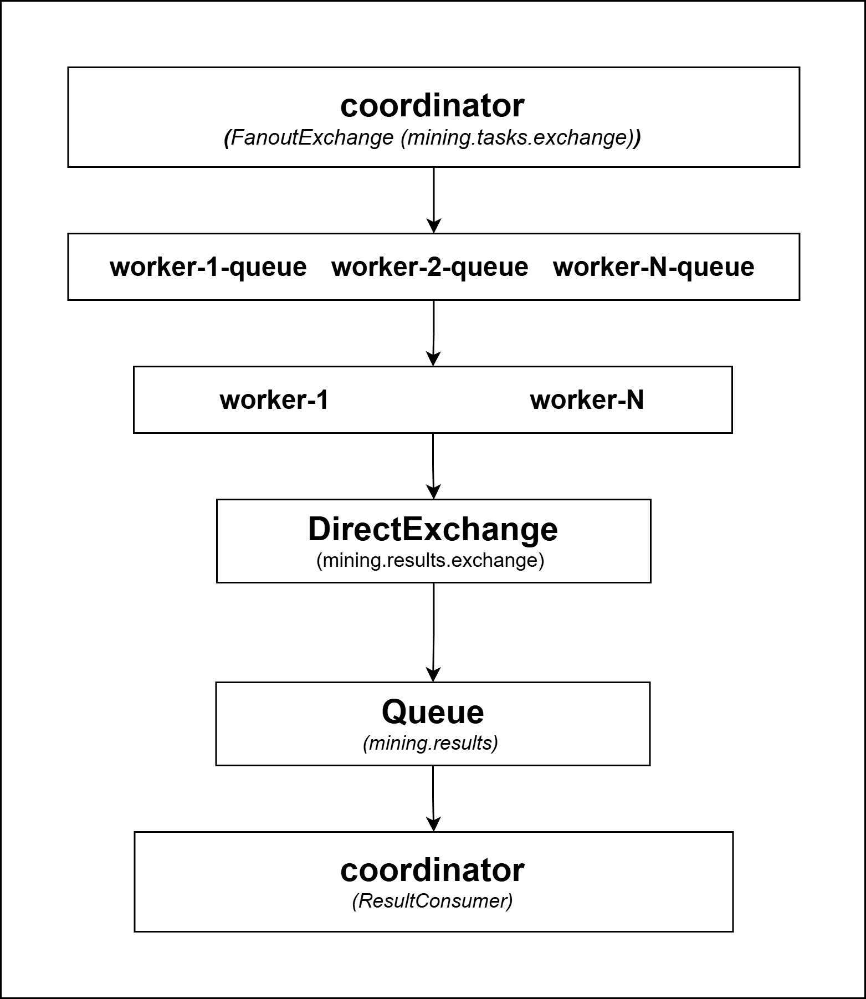

# Coordinator - Nodo Coordinador de Tareas (NCT)

## Descripción
Cerebro del sistema blockchain. Responsable de formar bloques con las
transacciones pendientes, publicar tareas de minería en RabbitMQ,
verificar los resultados de los workers, confirmar bloques válidos
y entregar recompensas al worker ganador. También notifica a la
blockchain-api cuando un bloque es confirmado para el broadcast WebSocket.

## Puerto: 8081

## Responsabilidades

### 1. Inicialización
Al arrancar verifica si existe el bloque génesis en Redis.
Si no existe, lo crea automáticamente (index=0, previousHash=0...0)
con una transacción COINBASE de sistema.

### 2. Recepción de bloques del Transaction Pool (NCT.1)
Recibe bloques formados del Transaction Pool via `POST /api/coordinator/mine-block`
y los publica como tarea en el exchange fanout de RabbitMQ con:
- Hash del último bloque confirmado (leído de Redis)
- Lista de transacciones pendientes
- Nivel de dificultad actual (prefijo)
- Rango de búsqueda del nonce [0, workerCount * rangeSize]

### 3. Competencia de workers (NCT.2)
Los workers están suscritos al exchange fanout y reciben la tarea
simultáneamente. Compiten por resolver el PoW. El primero en encontrar
un nonce válido publica su resultado en la queue `mining.results`.

### 4. Verificación (NCT.3)
Al recibir un resultado el Coordinator:
- Usa CAS (compareAndSet) para garantizar que solo el primer resultado válido gane
- Recalcula el hash localmente: `MD5(nonce + str + bcContent)`
- Verifica que el hash comience con el prefijo requerido
- Descarta resultados tardíos de otros workers automáticamente

### 5. Confirmación y recompensa (NCT.4)
Si el hash es válido:
- Agrega una transacción COINBASE al bloque (recompensa de 50 coins al worker ganador)
- Guarda el bloque completo en Redis
- Notifica a blockchain-api via `POST /api/events/block-mined` para broadcast WebSocket
- Limpia las transacciones confirmadas del pool pendiente

## Endpoints REST
| Método | Endpoint                      | Descripción                                         |
| ------ | ----------------------------- | --------------------------------------------------- |
| POST   | `/api/coordinator/mine-block` | Recibe bloque del Transaction Pool e inicia minería |
| GET    | `/api/coordinator/status`     | Estado del coordinator y último bloque              |

#### Body POST /api/coordinator/mine-block
```json
{
  "transactions": [...],
  "prefix": "000",
  "workerCount": 2
}
```

#### Response POST /api/coordinator/mine-block
```json
{
  "taskId": "uuid",
  "blockIndex": 1,
  "prefix": "000",
  "rangeMin": 0,
  "rangeMax": 10000000
}
```

## Arquitectura de mensajería RabbitMQ


## Consenso
Implementado en `ConsensusService` con `ConcurrentHashMap` + `AtomicBoolean`.
El primer resultado válido que llegue gana. Los demás son descartados con log de aviso.

## Configuración
```properties
server.port=8081
spring.data.redis.host=${REDIS_HOST:localhost}
spring.data.redis.port=${REDIS_PORT:6379}
spring.data.redis.password=${REDIS_PASS:redis123}
spring.rabbitmq.host=${RABBITMQ_HOST:localhost}
spring.rabbitmq.port=${RABBITMQ_PORT:5672}
spring.rabbitmq.username=${RABBITMQ_USER:admin}
spring.rabbitmq.password=${RABBITMQ_PASS:admin123}
mining.prefix=${MINING_PREFIX:000}
mining.reward=50.0
mining.range-size=10000000
services.blockchain-api.url=${BLOCKCHAIN_API_URL:http://localhost:8080}
```

## Levantar
```bash
mvn clean package -DskipTests
java -jar target/coordinator-1.0.0-SNAPSHOT.jar
```

## Verificar
```bash
curl http://localhost:8081/api/coordinator/status
```