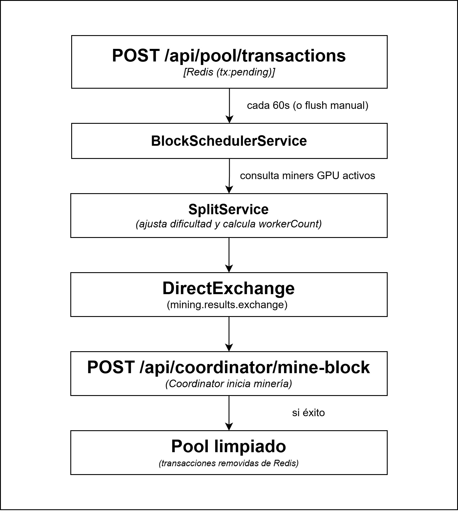

# Transaction Pool (TrP) - Pool de Transacciones

## Descripción

Servicio que recibe transacciones individuales, las acumula en Redis
y cada 60 segundos las agrupa en un bloque para enviarlo al Coordinator.
También gestiona la disponibilidad de miners GPU y ajusta la dificultad
dinámicamente según los recursos disponibles.

## Puerto: 8082

## Responsabilidades

### 1. Recepción de transacciones

Recibe transacciones via REST y las almacena en Redis como pendientes.

### 2. Agrupación en bloques (scheduler cada 60 segundos)

Toma todas las transacciones pendientes, las agrupa y envía al Coordinator
via `POST /api/coordinator/mine-block`. El Coordinator es quien determina
el índice y hash del bloque anterior leyendo Redis directamente.

### 3. Ajuste dinámico de dificultad

Antes de enviar el bloque al Coordinator, consulta si hay miners GPU activos:

- Con GPU disponibles → usa el prefijo configurado (ej: `000`)
- Sin GPU disponibles → reduce el prefijo en un carácter (ej: `000` → `00`)

Esto garantiza que la red siga funcionando aunque sea más "fácil" cuando
solo hay miners CPU disponibles.

### 4. Gestión de miners GPU (keep-alive)

Recibe señales de vida de los miners GPU cada N segundos.
Un miner GPU se considera inactivo si no envía keep-alive en los últimos
30 segundos. La cantidad de miners activos determina el `workerCount`
enviado al Coordinator para calcular el rango de búsqueda del nonce.

## Endpoints REST

| Método | Endpoint                     | Descripción                                                |
| ------ | ---------------------------- | ---------------------------------------------------------- |
| POST   | `/api/pool/transactions`     | Recibe nueva transacción                                   |
| GET    | `/api/pool/transactions`     | Lista transacciones pendientes                             |
| POST   | `/api/pool/flush`            | Fuerza el procesamiento inmediato sin esperar el scheduler |
| GET    | `/api/pool/status`           | Estado del pool (cantidad de tx pendientes)                |
| POST   | `/api/pool/miners/keepalive` | Keep-alive de miner GPU                                    |

### Body POST /api/pool/transactions

```json
{
  "id": "tx-001",
  "sender": "Alice",
  "receiver": "Bob",
  "amount": 10.5,
  "timestamp": "2026-05-21T12:00:00Z",
  "type": "TRANSFER"
}
```

## Flujo de procesamiento



## Configuración

```properties
server.port=8082
spring.data.redis.host=${REDIS_HOST:localhost}
spring.data.redis.port=${REDIS_PORT:6379}
spring.data.redis.password=${REDIS_PASS:redis123}
pool.block-interval=${BLOCK_INTERVAL:60}
pool.default-prefix=${MINING_PREFIX:000}
services.coordinator.url=${COORDINATOR_URL:http://localhost:8081}
```

## Levantar

```bash
mvn clean package -DskipTests
java -jar target/transaction-pool-1.0.0-SNAPSHOT.jar
```

## Verificar

```bash
# Ver transacciones pendientes
curl http://localhost:8082/api/pool/transactions

# Forzar procesamiento inmediato
curl -X POST http://localhost:8082/api/pool/flush

# Estado del pool
curl http://localhost:8082/api/pool/status
```
