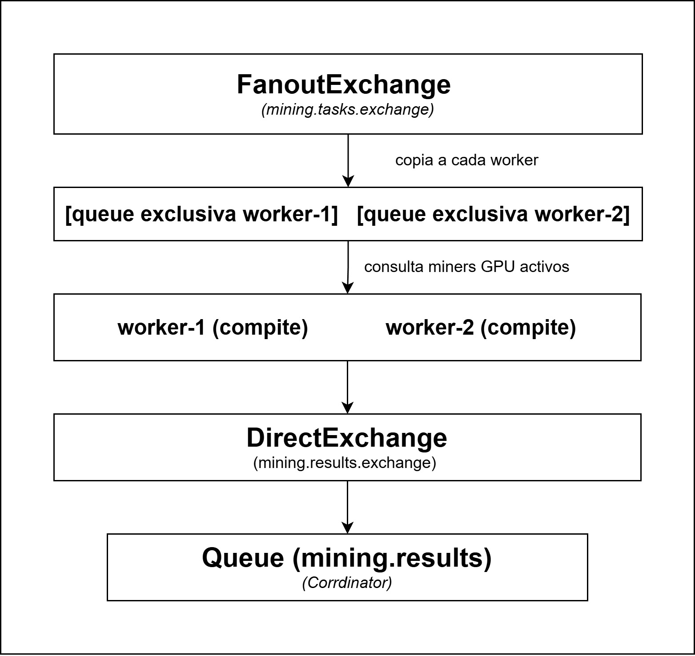

# Worker - Nodo Minero CPU

## Descripción
Nodo trabajador que se suscribe al exchange fanout de RabbitMQ, recibe
tareas de minería y compite con otros workers por resolver el Proof of Work.
Usa Java 21 con ExecutorService para paralelizar la búsqueda del nonce
entre múltiples hilos. El primero en encontrar una solución válida la
publica en la queue de resultados de RabbitMQ para que el Coordinator la procese.

## Puerto: 8083

## Funcionamiento

### 1. Suscripción
Al arrancar crea una queue exclusiva y efímera vinculada al exchange fanout
`mining.tasks.exchange`. Cada instancia recibe una copia de cada tarea
publicada por el Coordinator, permitiendo la competencia entre workers.

### 2. Recepción de tarea
Al recibir una `MiningTask` extrae:
- `str` y `bcContent` para construir el input del hash
- `prefix` como objetivo del PoW (ej: `000`)
- `rangeMin` y `rangeMax` como límites de búsqueda del nonce

### 3. Minería multi-hilo
El `PoWMiner` divide el rango `[rangeMin, rangeMax]` entre N threads.
Cada thread busca independientemente. El primero en encontrar un nonce
válido activa un `AtomicBoolean` que cancela a los demás threads.
Un nonce es válido si: `MD5(nonce + str + bcContent)` comienza con `prefix`.

### 4. Publicación del resultado
- Si encuentra el nonce: publica `MiningResultEvent` con `success=true`,
  `nonce`, `blockHash` y `elapsedMs` en `mining.results.exchange`.
- Si no encuentra en el rango: publica con `success=false`.
- El Coordinator usa CAS para aceptar solo el primer resultado válido
  y descartar los tardíos.

## Arquitectura de mensajería


## Endpoints REST
| Método | Endpoint             | Descripción                             |
| ------ | -------------------- | --------------------------------------- |
| GET    | `/api/worker/status` | Estado del worker (id, threads, estado) |

## Configuración
```properties
server.port=${SERVER_PORT:8083}
worker.id=${WORKER_ID:worker-1}
worker.threads=${WORKER_THREADS:8}
spring.rabbitmq.host=${RABBITMQ_HOST:localhost}
spring.rabbitmq.port=${RABBITMQ_PORT:5672}
spring.rabbitmq.username=${RABBITMQ_USER:admin}
spring.rabbitmq.password=${RABBITMQ_PASS:admin123}
```

## Levantar múltiples instancias
Cada instancia debe tener un ID y puerto distintos para competir correctamente:

```bash
# Instancia 1
java -jar target/worker-1.0.0-SNAPSHOT.jar \
  --worker.id=worker-1 --server.port=8083

# Instancia 2
java -jar target/worker-1.0.0-SNAPSHOT.jar \
  --worker.id=worker-2 --server.port=8084

# Instancia 3
java -jar target/worker-1.0.0-SNAPSHOT.jar \
  --worker.id=worker-3 --server.port=8085
```

## Levantar
```bash
mvn clean package -DskipTests
java -jar target/worker-1.0.0-SNAPSHOT.jar
```

## Verificar
```bash
curl http://localhost:8083/api/worker/status
# {"workerId":"worker-1","threads":8,"status":"running"}
```